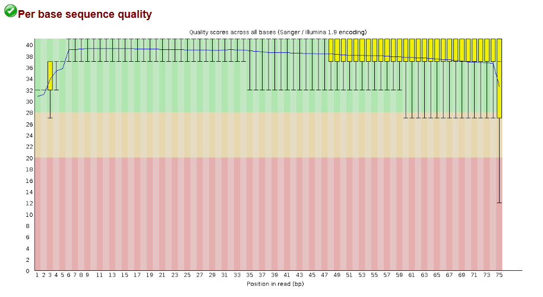
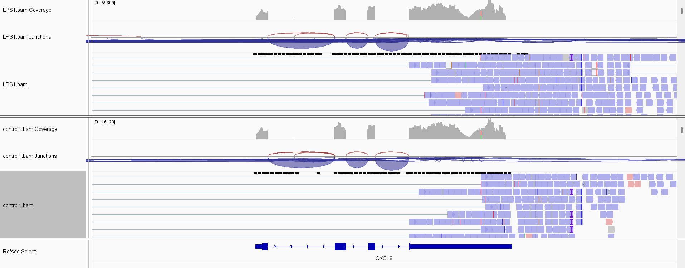
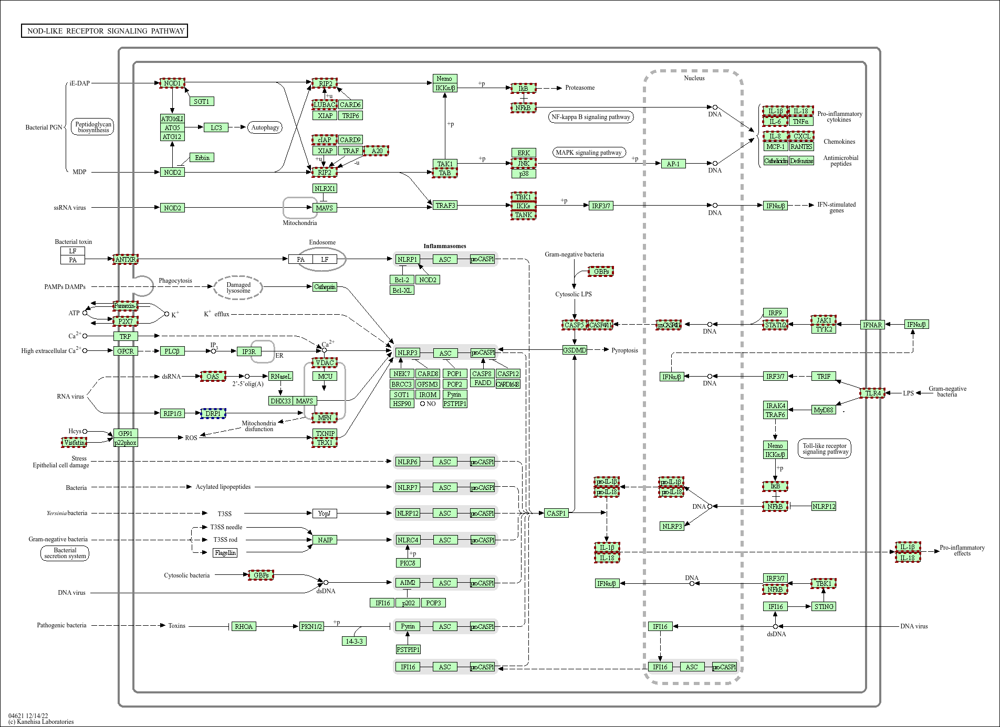
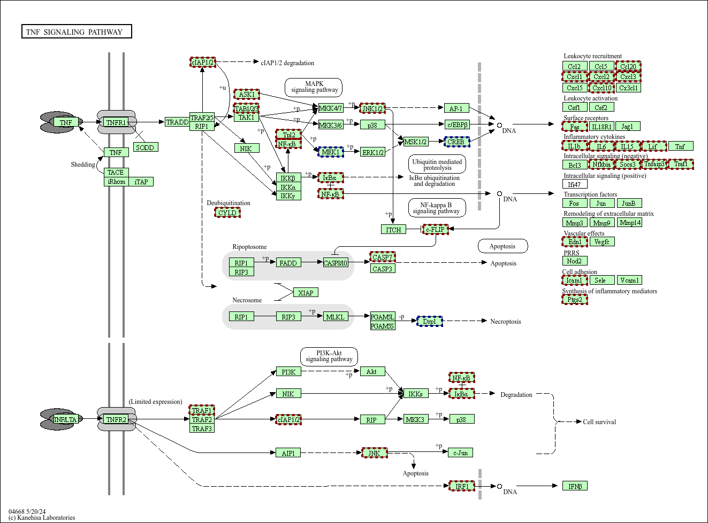
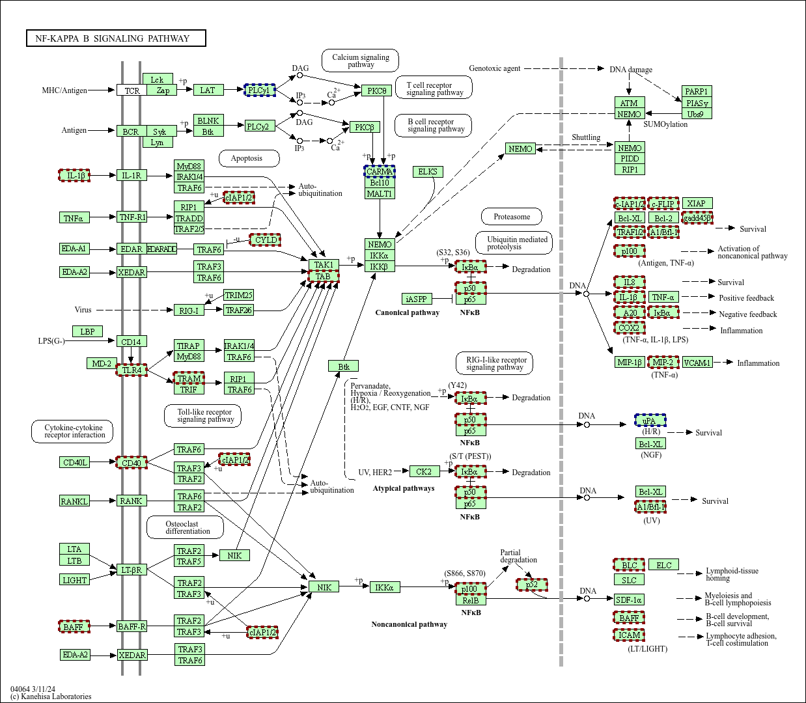

```{r setup, include=FALSE}
knitr::opts_chunk$set(echo = TRUE)

```

``` {r libraries, echo = FALSE, message = FALSE, warning = FALSE}

library(magick)
library(tidyverse)
library(knitr)
library(kableExtra)

```

# 1 Meta Data Format

### 1.1 FASTQ files:

Fast Alignment Sequence Quality Files are a text based format for storing sequences of DNA or RNA. They typically include four lines: a header/ID for the sequence, the sequence itself, a '+', and a series of quality scores. The quality scores are ASCII values which correlate to the Phred quality score, which represents the confidence that the nucleotide base is correct during sequencing. Each base in the sequence will have a corresponding score. Generally speaking, a good Phred score is that of 20 or above, which indicates a 99% accuracy rate, with 30+ (99.9% accurate) considered excellent.

The benefit of FASTQ format is that it is standardised and widely used, and therefore will work with most programs, and that the quality of the sequence can be interrogated. This allows programs such as FASTQC to determine the quality of data, and improve the integrity of results. 

### 1.2 SAM/BAM files:

Sequence Alignment Map (SAM) files are used to store alignment data from programs such as Hisat2. The contain a header/ID, read sequences, mapping positions, and quality scores. SAM files are useful, but can reach unmanageable sizes when mapping to larger genomes.

Binary Alignment Map (BAM) files are binary versions of SAM files, which are compressed. This is useful as BAM files take up less storage space, are easier to share, and are more efficient, but makes them difficult to interpret visually. BAM files are accompanied by .bai files, which are corresponding index files used to map the reads stored in BAM format onto a genome for easier visualisation and interrogation of gene function. 

Together, SAM/BAM files provide an efficient method of storing and sharing sequence alignment data.


### 1.3 GTF/GFF files:

General Transfer Format (GTF) files are tab-delimited text (.txt) files which contain information on gene structure. It is a widely used format, and so is compatible with many programs, and contains multiple variables which can help to contextualise genes with the wider genome, such as the start and end position, the forward/reverse strand, and the chromosome location. 

General Feature Format (GFF) files are similar to GTF files, but are slightly outdated. GTF format is identical to GFF version 2. 

# 2. RNA Sequencing Analysis

The analysis is centred on a series of FASTQ format sequencing files obtained from human macrophages from two groups; one control, and one exposed to lipopolysaccharide (LPS), a well-characterised bacterial cell wall component.

## 2.1 Analysis Pipeline Overview

The data set LPS-stimulated macrophages was cloned from a publicly available history on Galaxy Europe available at: https://usegalaxy.eu/histories/view?id=5e541080e34e4ea4. FASTQ files for read 1 and 2 were grouped together per sample, for a total of 4 LPS-stimulated repeats and 4 control samples. 

FASTQC was used to check the read quality based on the Phred quality scores located in the FASTQ files. All reads were of high enough quality to feed forward into later analysis, as shown below on the LPS-Stimulated Repeat 1 (LPS1) sample:

```{r, out.width = 500, echo = FALSE}

# demonstrate FASTQC output


```
Image screenshot from Galaxy Europe via FASTQC tool.


Although there is some drop-off in quality towards the end of the reads, this is standard for Illumina-derived data. Otherwise, the majority of bases have an average Phred score above 30, indicating there is 99.9% confidence that they have been sequenced correctly.

The reads were then mapped to the 2013 hg38 Human Genome via Hisat2, with 'Strand Information' set as 'Forward Strand'. The .bam files generated were downloaded alongside their respective index (.bai) files for visualisation in IGV viewer (Robinson et al., 2011) to ensure that the reads were mapped correctly. The sample below compares reads from LPS 1 and Control 1 samples. Clicking the blue read blocks shows displays a pop-up containing 'XS: +' indicating the the reads having been read in the forward direction.

``` {r, out.width = 500, echo = FALSE}

# demonstrate readings in IGV view here


```
Image Screenshot from IGV Viewer version 2.19.6.

Genetic expression was quantified via StringTie, which output a .txt file containing the fragments per kilobase exon per million reads mapped (FPKM) as a normalised measure of gene expression. Gene counts were quantified via FeatureCounts, which utilized the .bam file output by Hisat2 and a .gtf file downloaded from GenCode containing version 49 of gene annotations for the Human genome. The resulting table was split into control/LPS samples using the collections operations options available on Galaxy, and was downloaded as a .csv file for future analysis.

The control/LPS samples were input into Deseq2 to identify differencially expressed RNAs. Information related to gene names and their classification was downloaded from ensembl and combined with the Deseq2 output by 'Gene ID' to produce a large data set of results, which was downloaded as a .csv file. 


## 2.2 10 Genes with Highest Absolute/Fold Change in Response to LPS Stimulation

The output from StringTie and FeatureCounts was imported into R for analysis. Four LPS and four Control samples were averaged together each to produce an average FPKM per gene. Fold change was calculated as the log base 2 of each LPS value divided by control, and absolute change was calculated as each LPS value minus control. Each measure was ordered by absolute value to identify genes with the highest expression change, and the top ten absolute/fold change values were extracted, as shown in table format below. 

### 2.2.1 Fold Change

``` {r, echo = FALSE, message = FALSE, warning = FALSE}

# read in fold/absolute change files
fold <- read.csv('fold_change.csv')

# remove row values
fold <- fold[, 2:4]

# display as table via kable
fold %>%
  summarise(
    Gene_Name = Gene.Name,
    Fold_Change = fold_change
  ) %>%
  knitr::kable()

```


### 2.2.2 Absolute Change

``` {r, echo = FALSE, message = FALSE, warning = FALSE}

# read in fold/absolute change files
abs <- read.csv('absolute_change.csv')

# remove row values
abs <- abs[, 2:4]

# display as table via kable
abs %>%
  summarise(
    Gene_Name = Gene.Name,
    Absolute_Change = absolute_change
  ) %>%
  knitr::kable()

```

Genes GNPNAT1 and MT-RNR1 are upregulated in LPS-exposed macrophages relative to untreated control in both absolute and fold change. Generally, fold change is a better measure of differential expression as it a linear value [is this true?]. Interestingly, GNPNAT1 codes for an enzyme in the hexosamine pathway, and it's upregualtion has been found to be linked with increased immune infiltration in breast cancer. 

## 2.3 Up/Downregulated mRNAs and lncRNAs

The combined ensembl/Deseq2 output was imported into R for analysis. Reads which did not correlate to mRNA (referred to as 'protein_coding' in ensembl) or lncRNA were removed from the data set, as well as those with no significant difference in FPKM fold change (adjusted P-value > 0.05). Genes were assigned as being up or downregluated, and the number of up/downregulated genes were summarised.


``` {r, echo = FALSE, message = FALSE}

# read in data
mRNAs <- read.csv('mRNAs_for_table.csv')

colnames(mRNAs)[5] <- 'mRNA'

# display as table
mRNAs %>%
  group_by(mRNA) %>%
  summarise(
    No. = n()
  ) %>%
  knitr::kable()

```


``` {r, echo = FALSE, message = FALSE}

lncRNAs <- read.csv('lncRNAs_for_table.csv')

colnames(lncRNAs)[5] <- 'lncRNA'

lncRNAs %>%
  group_by(lncRNA) %>%
  summarise(
    No. = n()
  ) %>%
  knitr::kable()

```

The resulting list of mRNAs/lncRNAs were were ordered by FPKM fold change magnitude and was exported as a .txt file with two columns for input into DAVID, one containing the Gene ID and the other containing the FPKM fold change. 

## 2.4 KEGG Pathways Associated with LPS Stimulation

The .txt file was uploaded into DAVID, which returned a list of pathways associated with the genes, the top 5 of which are displayed below. 'No. of Genes Matched' refers to the number of genes from the dataset which were present within the pathway.

``` {r, echo = FALSE, message = FALSE}

# DAVID output
david <- read.csv('DAVIDresults.csv')

david <- david %>%
  select(Term, Count) %>%
  slice(1:5)

colnames(david) <- c('KEGG Pathway', 'No.of_Genes_Matched')

david %>%
  knitr::kable()

```

Overall, several inflammatory pathways within macrophages were upregulated by LPS, as supported in other literature (Guzmán-Beltrán et al., 2017). This primarily includes the NOD-like receptor signalling pathway, the TNF signalling pathway, and the NF-kappa B signalling pathway, in which many key inflammatory and immune reponse genes are upregulated. Examples are provided below, with screenshots taken from the US National Institute of Health's DAVID KEGG viewing platform. Upregulated genes are highlighted in red, downregulated genes in blue. 

### 2.4.1 NOD-like Receptor Signalling Pathway

``` {r, out.width = 500, echo = FALSE, message = FALSE}

# screenshot


```

Analysis of the NOD-like Receptor KEGG pathway shows that genes favouring the pro-inflammatory response are heavily upregulated. Pro-inflammatory cytokines such as IL-1B, IL-6, and IL-8 appear to have increased expression, as well as initiators for key inflammatory pathways such as NF-KB. 

### 2.4.2 TNF Signalling Pathway

``` {r, out.width = 500, echo = FALSE, message = FALSE}

# screenshot


```
Similarly, the TNF signalling pathway shows upregulation of nearly all related pro-inflammatory cytokines, and of key leukocyte recruitment factors, indicating a more widespread immune response.

### 2.4.3 NF-kappa B Signallng Pathway

``` {r, out.width = 500, echo = FALSE, message = FALSE}

# screenshot


```

Finally, interrogation of the NF-kB pathway demonstrates the unregulation of several key mediators of inflammation, such as COX2, and IL-8.

To summarise, the results from the pipeline suggest that LPS-stimulation of human macrophages upregulates several key genes involved in initiating and maintaining both a local and wider immune response, including NF-kB, several inflammatory cytokines, and COX2.

# 3. Command Line Hisat2 and Stringtie

Most bioinformatics programs can also be run on the command line. Examples of how to run Hisat2 and StringTie are included below. 

## 3.1 Hisat2:

Before Hisat2 can be used on the command line, the genome index (based on the reference genome) must be built from the FASTA file via hisat2-build.
``` {r, echo = FALSE, message = FALSE}

# first build genome index
print('> hisat2-build hg38.fa hg38')

```

After, the sequence FASTQ files can be mapped to the reference genome, and output to a .sam file.

```{r, echo = FALSE, message = FALSE}

# then apply tool using index
print('> hisat2 -x hg38 -1 control1_1.fastq -2 control1_2.fastq -S control1.sam')

```

-x marks the reference genome, here we are using the human genome 2013 hg38 (index built on the last line).

-1 marks the forward reads reference

-2 marks the reverse reads reference

-S marks the output SAM file name

The presence of -1 and -2 indicates that the reads are paired, otherwise would use -U. 


## 3.2 StringTie:

For files to be input to StringTie, they must first be in .bam format. If using command line Hisat2 (Section 3.1, above) then the output will be in .sam format. This conversion can be performed using samtools.

``` {r, echo = FALSE, message = FALSE}

print('> samtools view -b -S control1.sam > control1.bam')

```

After conversion, the .bam file must be sorted.

```{r, echo = FALSE, message = FALSE}

print('> samtools sort -m control1.bam -o control1_sorted.bam')

```

The sorted .bam file can bow be input into StringTie.

``` {r, echo = FALSE, message = FALSE}

print('> stringtie control1_sorted.bam -o control1.gtf -A control1.tab')

```

-o marks the .gtf output file

-A marks the output file containing the relative abundance of each gene 

# Data Access

This document was created in R markdown. The .Rmd file is available at: https://github.com/en472/RNA-Seq-Analysis

# References

Guzmán-Beltrán, S., Torres, M., Arellano, M. and Juárez, E., 2017. Human macrophages chronically exposed to LPS can be reactivated by stimulation with MDP to acquire an antimicrobial phenotype. Cellular Immunology, 315, pp. 45-55.

Robinson, J.T., Thorvaldsdóttir, H., Winckler, W., Guttman, M., Lander, E.S., Getz, G. and Mesirov, J.P., 2011. Integrative genomics viewer. Nature Biotechnology, 29(1), pp. 24-26.s

